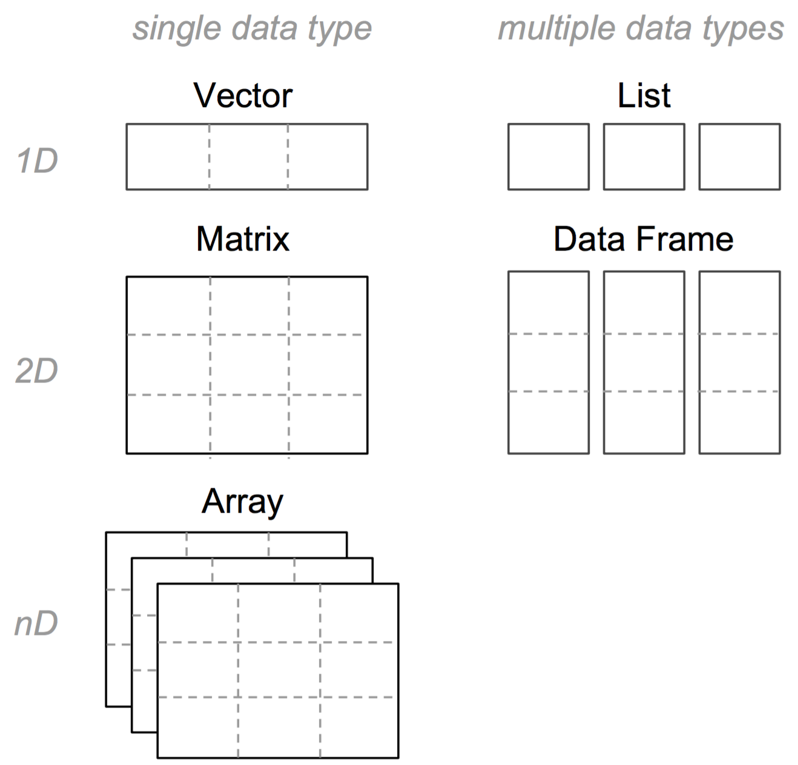

```{r, setup, include=FALSE}
library(knitr)
# smaller font size for chunks
knitr::opts_chunk$set(size = 'footnotesize')
options(width=78)
```

# 

\begin{center}
\Huge{\hilit{Data Structures (part 1)}}
\end{center}


# Data Types and Data Structures

## To make the best of the R language, you'll need a strong understanding of the basic __data types__ and __data structures__, and how to operate on them.


# Data Types in R

A __data type__ is the most elemental data value in a programming language.
The data types that come built into R are:

- Integer (whole numbers)
- Double (real or decimal numbers)
- Logical (boolean: TRUE, FALSE)
- Character (strings)

In addition, R provides two less common types:

- Complex*
- Raw*


# R Vectors

## In order to work with data types, R provides vectors

- A vector is the most basic data structure in R
- Vectors are contiguous cells containing data
- Can be of any length (including zero)
- There are really no scalars, just one-element vectors


# Vectors

Based on the data types, R has five kinds or __modes__ of vectors:

- `"integer"` (whole numbers, no decimal component)
- `"numeric"` (i.e. double or real/decimal numbers)
- `"logical"` (i.e. boolean, true/false)
- `"character"` (i.e. strings)
- `"complex"` 


# One-element vectors

The most simple type of vectors are "scalars" which are simply single value vectors:
```{r}
# integer
x <- 1L
# double (real)
y <- 5
# complex
z <- 3 + 5i
# logical
a <- TRUE
# character
b <- "yosemite"
```


# Vectors

The function to create a vector from individual values is __`c()`__, 
short for __catenate__:

```{r}
# some vectors
x <- c(1, 2, 3, 4, 5)

y <- c("one", "two", "three")

z <- c(TRUE, FALSE, FALSE)
```
Separate each element by a comma


# Some confusing terminology

- `mode()`: the "mode" of an object (compatible with the S language)
- `typeof()`: R internal type of storage (for C compatibility)
- `storage.mode()`: generally used when calling functions written in C or FORTRAN to ensure that R objects have the apropriate data types
- `class()`: all objects in R have a class


# Data types, modes, etc

| example       | class      | mode    | typeof  | storage |
| ------------- | ---------- |-------- | ------- | ------- |
| `1L, 2L`      | integer    | numeric | integer | integer |
| `1, -0.5`     | numeric    | numeric  | double  | double  |
| `3 + 5i`      | complex    | complex | complex | complex |
| `TRUE, FALSE` | logical    | logical | logical | logical |
| `"hello"`     | character  | character | character | character |


# Vectors of a given class

Sometimes is useful to initialize vectors of a particular class by simply specifying the number of elements:

```{r}
# five element vectors
int <- integer(5)
num <- numeric(5)
comp <- complex(5)
logi <- logical(5)
char <- character(5)
```


# Special Values

There are some special values:

- `NULL` is the null object (it has length zero)
- `NA` is the value used to represent missing values (Not Available)
- `Inf` indicates positive infinite
- `-Inf` indicates negative infinite
- `NaN` indicates Not a Number (different from `NA`)


# Special Values

```{r, eval = FALSE}
# Inf
1 / 0

# -Inf
-1 / 0

# NaN
0 / 0
sqrt(-1)
```

# About `NA` values (more technicalities)

- The generic value `NA` is a logical value
- However, there are missing values for every mode:
    - `NA_integer_`
    - `NA_real_`
    - `NA_character_`
    - `NA_complex_`
- On screen, all `NA`'s are displayed the same


# Atomic Vectors

- vectors are __atomic__ structures
- the values in a vector must be ALL of the same type or mode
- either all integers, or reals, or complex, or characters, or logicals
- you cannot have a vector of different data types


# Atomic Vectors

If you mix different data values, R will __implicitly coerce__ them so they 
are all of the same type
```{r}
# mixing numbers and characters
x <- c(1, 2, 3, "four", "five")
x
# mixing numbers and logical values
y <- c(TRUE, FALSE, 3, 4)
y
```


# More implicit coercion

If you mix different data values, R will __implicitly coerce__ them:
```{r}
# mixing integers and reals
x <- c(1L, 2L, 3.3, 4.4, 5.5)
x
# mixing integers and complex numbers
y <- c(3 + 1i, 1L, -4 - 2i, 4L)
y
```


# How does R coerce data types?

R follows two basic rules of implicit coercion:

- If a character is present, R will coerce everything else to characters

- If a vector contains logicals and numbers, R will convert the logicals to numbers (`TRUE` to 1, `FALSE` to 0)


# Explicit Coercion functions

R provides a set of __explicit coercion__ functions that allow us to 
``convert'' one type of data into another

- `as.character()`
- `as.numeric()`
- `as.integer()`
- `as.logical()`


# More coercion

What's the result of the following coercions:

```{r eval=FALSE}
as.numeric(c("one", "two", "three"))

as.logical(c("TRUE", "FALSE", "NA", "true", "false"))

as.integer(c(1.2, -0.9999, -pi, exp(1)/exp(1)))

as.character(c(1, 2, 3))

as.numeric("1") + as.numeric("2")
```


# Properties of Vectors

- all vectors have a length
- vector elements can have associated names
- vectors have a class:
    + e.g. `"integer"`, `"numeric"`, `"logical"`, `"character"`
- vectors have a mode (storage mode)


# Properties of Vectors

```{r}
# vector with named elements
x <- c(a = 1, b = 2.5, c = 3.7, d = 10)
x
length(x)
mode(x)
```


# Attributes

If a vector has named elements, the names are an attribute
```{r}
# vector with named elements
x <- c(a = 1, b = 2.5, c = 3.7, d = 10)
x

attributes(x)
```


# Attributes of R objects

You can actually add attributes to R objects with the function `attr()`
```{r}
attr(x, "units") <- "inches"
attr(x, "origin") <- "USA"

x
```


# From Vectors to Arrays

We can transform a vector in an __n-dimensional__ array by giving it a 
dimensions attribute with __`dim()`__
```{r}
# positive: from 1 to 8
x <- 1:8

# adding 'dim' attribute
dim(x) <- c(2, 4)
x
```


# Sequences with the colon operator

One very useful way of generating vectors is using the sequence operator __`:`__. 
The expression $n_1:n_2$, generates the sequence of integers ranging from 
$n_1$ to $n_2$.

```{r}
1:10

5:-5
```


# Sequences with the function `seq()`

More complex numeric sequences can be created with `seq()`

```{r, eval = FALSE}
# sequences
seq(1)
seq(from = 1, to = 5)
seq(from = -3, to = 9)
seq(from = -3, to = 9, by = 2)
seq(from = -3, to = 3, by = 0.5)
seq(from = 1, to = 20, length.out = 5)
```


# More sequences

Two sequencing variants of `seq()` are `seq_along()` and `seq_len()`

- `seq_along()` returns a sequence of integers of the same length as its argument

- `seq_len()` generates a sequence from 1 to the value provided


# More sequences

```{r}
# some flavors
flavors <- c("chocolate", "vanilla", "lemon") 

# sequence of integers from flavors
seq_along(flavors)
# sequence from 1 to 5
seq_len(5)
```


# Vector Arithmetic

You can do vector arithmetic manipulation in a "natural" way:

```{r}
x = 1:3

2 * x

(2 * x) + 1
```


# Recycling Rule

What is less obvious about vector arithmetic is what happens when vectors of 
different sizes are combined.

```{r}
c(1, 2, 3, 4) + c(1, 2)
```


# Binary Operations

The following binary operations all obey the recycling rule.

- `+` addition
- `-` subtraction
- `*` multiplication
- `/` division
- `^` raising to a power
- `%%` modulo (remainder after division) 
- `%/%` integer division


# R common data structures




# Arithmetic Operators

| Operation   | usage   |
| ------------|---------|
| unary `+`   | `+ y`   |
| unary `-`   | `- y `  |
| sum         | `x + y` |
| subtraction | `x - y` |
| multiplication   | `x * y` |
| division    | `x / y` |
| power       | `x ^ y` |
| modulo      | `x %% y` |
| integer division | `x %/% y`|


# Comparison Operators

| Operation             | usage    |
| --------------------- | -------- |
| less than             | `x < y`  |
| greater than          | `x > y`  |
| less than or equal    | `x <= y` |
| greater than or equal | `x >= y` |
| equality              | `x == y` |
| different             | `x != y` |


# Comparison operators and recycling rule

```{r}
c(1, 2, 3, 4, 5) <= 2

c(1, 2, 3, 4, 5) == 2

c(1, 2, 3, 4, 5) != 2
```


# Comparison Operators

When comparing vectors of different types, one is coerced to the type of the 
other, the (decreasing) order of precedence being character, complex, numeric, 
integer, logical

```{r eval = FALSE}
'5' == 5
5L == 5
5 + 0i == 5
```


# More Comparison Operators

In addition to comparison operators, we have the functions `all()` and `any()`
```{r eval = FALSE}
all(c(1, 2, 3, 4, 5) > 0)
all(c(1, 2, 3, 4, 5) > 1)
any(c(1, 2, 3, 4, 5) < 0)
any(c(1, 2, 3, 4, 5) > 4)
```


# Logical Operators

| Operation         | usage       |
| ----------------- | ----------- |
| NOT               | `!x`        |
| AND (elementwise) | `x & y`     |
| AND (1st element) | `x && y`    |
| OR (elementwise)  | `x | y`     |
| OR (1st element)  | `x || y`    |
| exclusive OR      | `xor(x, y)` |


# Logical Operators

```{r eval = FALSE}
!TRUE
!FALSE
TRUE & TRUE
TRUE & FALSE
FALSE & FALSE
TRUE | TRUE
TRUE | FALSE
FALSE | FALSE
xor(TRUE, FALSE)
xor(TRUE, TRUE)
xor(FALSE, FALSE)
```


# Logical and Comparison Operators

Many operations involve using logical and comparison operators:
```{r eval = FALSE}
x <- 5

(x > 0) & (x < 10)
(x > 0) | (x < 10)
(-2 * x > 0) & (x/2 < 10)
(-2 * x > 0) | (x/2 < 10)
```


# 

\begin{center}
\Huge{\hilit{Subsetting and Indexing}}
\end{center}


# Notation System

Bracket Notation to extract values from Vectors

- to extract values use brackets: `[ ]`
- inside the brackets specify indices
- use as many indices, separated by commans, as dimensions in the object
- vectors are one-dimensional objects, so you use one index object
- indices can be numbers, logicals, and some times names


# Manipulating Vectors

```{r}
# some vector
vec <- 1:5

# adding names
names(vec) <- letters[1:5]
vec
```


# Extracting values with numeric indices

```{r}
# first element (position 1)
vec[1]

# third element (position 3)
vec[3]
```


# Indices as sequence of values

```{r}
vec[1:3]

vec[c(1, 3, 4)]
```


# Indices with negative numbers

```{r}
# all values except the first one
vec[-1]

# all values except 2nd and 4th
vec[-c(2, 4)]
```


# Indices of logical values

```{r}
# first element
vec[c(TRUE, FALSE, FALSE, FALSE, FALSE)]

# 4th and 5th elements
vec[c(FALSE, FALSE, FALSE, TRUE, TRUE)]
```


# Indices of logical values

```{r}
# logical negation (2nd and 4th elements)
vec[!c(TRUE, FALSE, TRUE, FALSE, TRUE)]

# logical comparison
vec[vec >= 3]
```


# Indices with names

```{r}
# element 2 (3-times)
vec[c(2, 2, 2)]

# element 'a' (four times)
vec[c('a', 'a', 'a', 'a')]
```


