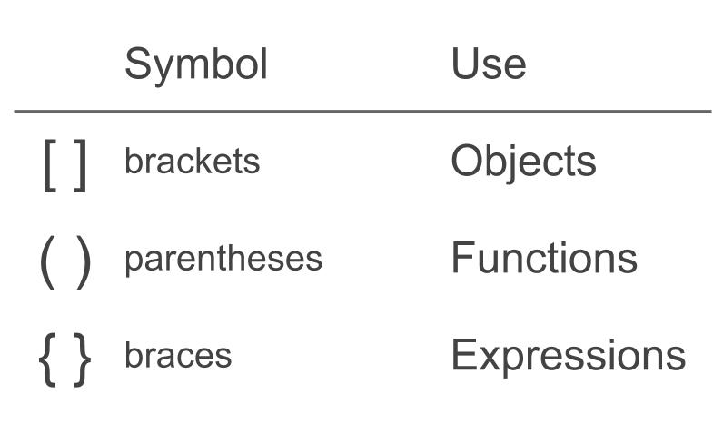

```{r, setup, include=FALSE}
library(knitr)
# smaller font size for chunks
knitr::opts_chunk$set(size = 'footnotesize', width = 78)
#options(width=78)
```

# 

\begin{center}
\Huge{\hilit{Expressions}}
\end{center}


# Expressions

## R code is composed of a series of expressions

- assignment statements
- arithmetic expressions
- function calls
- conditional statements
- loop statements
- etc


# Simple Expressions

```{r}
#  assignment statement
a <- 12345

# arithmetic expression
525 + 34 - 280

# function call
median(1:10)
```


# Expressions

One way to separate expressions is with new lines:

```{r results='hide'}
a <- 12345
525 + 34 - 280
median(1:10)
```

  
# Grouping Expressions

## Constructs for grouping together expressions

- semicolons `;`

- curly braces `{ }`


# Grouping Expressions

Grouping expressions with semicolons:

```{r}
a <- 10; b <- 20; d <- 30
```

Using semicolons, although valid, it is not a common practice among the 
R community


# Grouping Expressions

Grouping expressions with braces:
```{r}
{
  a <- 10
  b <- 20
  d <- 30
}
```


# Grouping Expressions

Grouping expressions in one line with semicolons within braces:
```{r}
{a <- 10; b <- 20; d <- 30}
```


# Compound Expressions

- Compound expressions consist of multiple simple expressions
- Compound expressions require braces
- Simple expressions in a compound expression can be separated by semicolons or newlines


# Value of Expressions

The value of an expression is the last evaluated statement:
```{r}
# value of an expression
{5 + 3; 4 * 2; 1 + 1}
```

The result has the visibility of the last evaluation


# Compound Expressions

It is possible to assign expressions to an object. Still, the variables inside the braces can be used in later expressions
```{r}
z <- {x <- 4; y <- x^2; x + y}
x
z
```


# Compound Expressions

Instead of assigning a compound expression to `z`:
```{r}
z <- {x <- 4; y <- x^2; x + y}
```

most R users would prefer something like this:
```{r}
x <- 4
y <- x^2
z <- x + y
```


# Using Expressions

## Expressions are typically used in

- Flow control structures (e.g. `for` loop)

- Functions


# Brackets, Parentheses, and Braces

```{r eval = FALSE}
# brackets for objects
dataset[1:10]

# parentheses for functions
some_function(dataset)

# braces for expressions
{
  1 + 1
  mean(1:5)
  tbl <- read.csv('datafile.csv')
}
```


# Brackets and braces in R




# Compound Expressions

Do not confuse a function call (having arguments in multiple lines) with a compound expression
```{r eval = FALSE}
# this is NOT a compound expression
plot(x = runif(10), 
     y = rnorm(10), 
     col = "#89F39A",
     main = "some plot",
     xlab = 'x', 
     ylab = 'y')
```


# Expressions

## In summary

- A program is a set of instructions
- Programs are made up of expressions
- R expressions can be simple or compound
- Every expression in R has a value


# 

\begin{center}
\Huge{\hilit{Basic Functions}}
\end{center}


# Motivation

R comes with many functions and packages that let us perform a wide variety of tasks. 

Sometimes, however, there's no function to do what we want to achieve. In these cases we need to create our own functions.


# Anatomy of a function

`function()` allows us to create a function. It has the following structure:
```{r eval = FALSE}
function_name <- function(arg1, arg2, etc) 
{
  expression_1
  expression_2
  ...
  expression_n
}
```


# Anatomy of a function

- Generally, we will give a name to a function
- A function takes one or more inputs (or none), known as _arguments_
- The expressions forming the operations comprise the __body__ of the function
- Functions with simple expressions don't require braces
- Functions with compound expressions do require braces
- Functions return a single value


# Function example

A function that squares its argument
```{r}
square <- function(x) {
  x * x
}
```

- the function name is `"square"`
- it has one argument: `x`
- the function body consists of one simple expression
- it returns the value `x * x`


# Function example

It works like any other function in R:
```{r}
square(10)
```

In this case, `square()` is also vectorized
```{r}
square(1:5)
```

Why is `square()` vectorized?


# Function example

Once defined, functions can be used in other functions definitions:
```{r}
sum_of_squares <- function(x) {
  sum(square(x))
}

sum_of_squares(1:5)
```


# Function example

Functions with a body consisting of a simple expression can be written with
no braces (in one single line!):
```{r}
square <- function(x) x * x

square(10)
```

However, we recommend you to always write functions using braces


# More about functions?

We'll discuss more details about functions in the next unit


# 

\begin{center}
\Huge{\hilit{Control Flow Structures}}
\end{center}


# Control Flow

There are many times where you don't just want to execute one statement
after another; you need to control the flow of execution


# Main Idea

\begin{center}
\Large{\mdlit{Execute some code when a codition is fulfilled}}
\end{center}


# Control Flow Structures

- if-then-else
- switch cases
- repeat loop
- while loop
- for loop


# 

\begin{center}
\Huge{\hilit{If-Then-Else}}
\end{center}


# If-then-else

__If-then-else__ statements make it possible to choose between two 
(possibly compound) expressions depending on the value of a logical condition

```{r}
# absolute value
num <- rnorm(1)
if (num >= 0) {
  num
} else {
  -num
}
```


# If-then-else

__If-then-else__ statements make it possible to choose between two 
(possibly compound) expressions depending on the value of logical condition

```{r eval=FALSE}
if (condition) expression1 else expression2
```

If `condition` is true then `expression1` is evaluated otherwise `expression2`
is executed


# If-Then-Else

If-then-else with __simple__ expressions (equivalent forms):
```{r eval = FALSE}
# no braces
if (condition) expression1 else expression2

# with braces
if (condition) { 
  expression1
} else { 
  expression2
}
```


# Example: if-then-else

Equivalent forms:
```{r eval=FALSE}
# simple if-then-else
if (5 > 2) 5 * 2 else 5 / 2

# simple if-then-else
if (5 > 2) { 
  5 * 2
} else { 
  5 / 2
}
```


# If-Then-Else

If-then-else with __compound__ expressions
```{r eval=FALSE}
# compound expressions require braces
if (condition) { 
  expression1
  expression2 
  ...
} else { 
  expression3 
  expression4 
  ...
}
```


# Considerations

- `if()` takes a __logical__ condition
- the condition must be a logical value of __length one__
- it executes the next statement if the condition is TRUE
- if the condition is FALSE, then it executes the false expression


# If and Else

```{r}
y <- -5

if (y > 0) {
  print("it is positive")
} else {
  print("it is negative")
}
```

The else statement must occur on the same line as the closing brace from the if clause!


# If and Else

The logical condition must be of length one!

```{r}
if (c(TRUE, TRUE)) { 
  print("it is positive")
} else {
  print("it is negative")
}
```


# Just If

It is also possible to have the __if__ clause (without _else_)
```{r eval = FALSE}
# just if
if (condition) { 
  expression1 
  ...
}
```

Equivalent to:
```{r eval = FALSE}
# just if
if (condition) { 
  expression1 
  ...
} else NULL
```


# Just If

If there is a single statement, you can omit the braces:

```{r eval=FALSE}
if (TRUE) { print("It is true") } 

if (TRUE) print("It is true")

# valid but not recommended
if (TRUE)
  print("It is true")
```


# Multiple If's

Multiple conditions can be defined by combining `if` and `else` repeatedly:
```{r}
set.seed(9)
x <- round(rnorm(1), 1)

if (x > 0) {
  print("x is positive")
} else if (x < 0) { 
  print("x is negative")
} else if (x == 0) { 
  print("x is zero")
}
```


# Vectorized `ifelse()`

`if()` takes a single logical value. If you want to pass a logical vector
of conditions, you can use `ifelse()`:
```{r}
true_false <- c(TRUE, FALSE)

ifelse(true_false, "true", "false")
```


# Vectorized If

```{r}
# some numbers
numbers <- c(1, 0, -4, 9, -0.9)

# are they non-negative or negative?
ifelse(numbers >= 0, "non-neg", "neg")
```


# Function `switch()`

When a condition has multiple options, combining several `if` and `else`
can become cumbersome


# Multiple if's

```{r eval=FALSE}
first_name <- "harry"

if (first_name == "harry") { 
  last_name <- "potter"
} else {
  if (first_name == "ron") {
    last_name <- "weasley" 
  } else {
    if (first_name == "hermione") { 
      last_name <- "granger"
    } else {
      last_name <- "not available"
    } 
  }
}
```


# Multiple selection with `switch()`

```{r}
first_name <- "ron"

last_name <- switch(
  first_name,
  harry = "potter",
  ron = "weasley",
  hermione = "granger",
  "not available")

last_name
```


# Multiple selection with `switch()`

- the `switch()` function makes it possible to choose between various
alternatives
- `switch()` takes a character string
- followed by several named arguments
- `switch()` will match the input string with the provided arguments
- a default value can be given when there's no match
- multiple expressions in a `switch()` can be enclosed by braces


# Multiple selection with `switch()`

```{r eval = FALSE}
switch(expr,
       tag1 = rcode_block1,
       tag2 = rcode_block2,
       ...
       )
```

`switch()` selects one of the code blocks, depending on the value of `expr`


# Switch example

```{r}
operation <- "add"

result <- switch(
  operation,
  add = 2 + 3,
  product = 2 * 3,
  division = 2 / 3,
  other = {
    a <- 2 + 3
    exp(1 / sqrt(a))
  }
)

result
```


# Switch example

- `switch()` can also take an integer as first argument
- in this case the remaining arguments do not need names
- instead, they will have associated integers

```{r}
switch(
  4,
  "one",
  "two",
  "three",
  "four")
```


# Empty code blocks in `switch()`

Empty code blocks can be used to make several tags match the same code block:
```{r}
student <- "ron"

house <- switch(
  student,
  harry = ,
  ron = ,
  hermione = "gryffindor",
  draco = "slytherin")
```

In this case a value of `"harry"`, `"ron"`, or `"hermione"` will cause
`"gryffindor"`


# 

\begin{center}
\Huge{\hilit{Loops}}
\end{center}


# About Loops

- Many times we need to perform a procedure several times
- The main idea is that of __iteration__
- For this purpose we use loops
- We perform the same operation several times as long as some condition
is fulfilled
- R provides three basic paradigms: `for`, `repeat`, `while`


# For Loops

- Often we want to repeatedly carry out some computation a fixed number of times. 
- For instance, repeat an operation for each element of a vector. 
- In R this is done with a __`for`__ loop.


# Motivation example

```{r}
prices <- c(2.50, 2.95, 3.45, 3.25)

prices
```


# Printing prices

```{r print_prices, eval = FALSE}
cat("Price 1 is", prices[1])
cat("Price 2 is", prices[2])
cat("Price 3 is", prices[3])
cat("Price 4 is", prices[4])
```

```{r print_prices, echo=FALSE}
```


# Printing prices

```{r}
for (i in 1:4) {
  cat("Price", i, "is", prices[i], "\n")
}
```


# Motivation example

```{r}
coffee_prices <- c(
  expresso = 2.50,
  latte = 2.95,
  mocha = 3.45, 
  cappuccino = 3.25)

coffee_prices
```


# Printing coffee prices

```{r print_coffee, eval = FALSE}
cat("Expresso has a price of", coffee_prices[1])
cat("Latte has a price of", coffee_prices[2])
cat("Mocha has a price of", coffee_prices[3])
cat("Capuccino has a price of", coffee_prices[4])
```

```{r print_coffee, echo = FALSE}
```


# Printing coffee prices

```{r}
for (i in 1:4) {
  cat(names(coffee_prices)[i], "has a price of", 
      prices[i], "\n")
}
```


# For Loops

`for` loops are used when we know exactly how many times we want the code to repeat

```{r eval = FALSE}
for (iterator in times) { 
  do_something
}
```

`for` takes an __iterator__ variable and a vector of __times__ to iterate 
through.


# For Loops

```{r}
value <- 2
for (i in 1:5) { 
  value <- value * 2 
  print(value)
}
```


# For Loops

The vector of _times_ does NOT have to be a numeric vector; it can be any vector
```{r}
value <- 2
times <- c('one', 'two', 'three', 'four')

for (i in times) { 
  value <- value * 2 
  print(value)
}
```


# For Loops and Next statement

Sometimes we need to skip a loop iteration if a given condition is met, this can be done with a next statement

```{r eval=FALSE}
for (iterator in times) { 
  expr1
  expr2
  if (condition) {
    next
  }
  expr3
  expr4
}
```


# For Loops and Next statement

```{r}
x <- 2

for (i in 1:5) {
  y <- x * i
  if (y == 8) {
    next
  }
  print(y)
}
```


# Nested Loops

It is common to have nested loops
```{r eval = FALSE}
for (iterator1 in times1) { 
  for (iterator2 in times2) {
    expr1
    expr2
    ...
  }
}
```


# Nested loops

```{r}
# some matrix
A <- matrix(1:12, nrow = 3, ncol = 4)

A
```


# Nested Loops

```{r}
# reciprocal of values less than 6
for (i in 1:nrow(A)) { 
  for (j in 1:ncol(A)) {
    if (A[i,j] < 6) A[i,j] <- 1 / A[i,j] 
  }
}

A
```


# For Loops and Vectorized Computations

- R `for` loops have bad reputation for being slow
- Experienced users will tell you "tend to avoid for loops in R" (me included)
- R provides a family of functions that are usually more efficient than loops
(i.e. `apply()` functions)
- You can start solving a problem using `for` loops
- Once you solved it, try to see if you can find a vectorized alternative
- It takes practice and experience to find alternative solutions to `for` loops
- There are cases when using `for` loops is not that bad


# Repeat Loop

`repeat` executes the same code over and over until a stop condition is met:
```{r eval=FALSE}
repeat { 
  keep_doing_something
  if (stop_condition) break
}
```

The `break` statement stops the loops. If you enter an infinite loop, you can
manually break it by pressing the `ESC` key.


# Repeat Loop

```{r}
value <- 2

repeat {
  value <- value * 2 
  print(value)
  if (value >= 40) break
}
```


# Repeat Loop

To skip a current iteration, use `next`
```{r}
value <- 2

repeat {
  value <- value * 2
  print(value)
  if (value == 16) {
    value <- value * 2
    next
  }
  if (value > 80) break 
}
```


# While Loops

It can also be useful to repeat a computation until a condition is false.
A `while` loop provides this form of control flow.

```{r eval=FALSE}
while (condition) { 
  keep_doing_something
}
```


# About while loops

- `while` loops are backward `repeat` loops
- `while` checks first and then attempts to execute
- computations are carried out for as long as the condition is true
- the loop stops when the condition is FALSE
- If you enter an infinite loop, break it by pressing `ESC` key


# While Loops

```{r}
value <- 2

while (value < 40) { 
  value <- value * 2 
  print(value)
}
```


# Repeat, While, For

- If you don't know the number of times something will be done, you can use
either `repeat` or `while`
- `while` evaluates the condition at the beginning
- `repeat` executes operations until a stop condition is met
- If you know the number of times that something will be done, use `for`
- `for` needs an _iterator_ and a vector of _times_


# Questions

- What happens if you pass `NA` as a condition to `if()`?
- What happens if you pass `NA` as a condition to `ifelse()`?
- What types of values can be passed as the first argument to `switch()`?
- How do you stop a `repeat` loop executing?
- How do you jump to next iteration of a loop?

