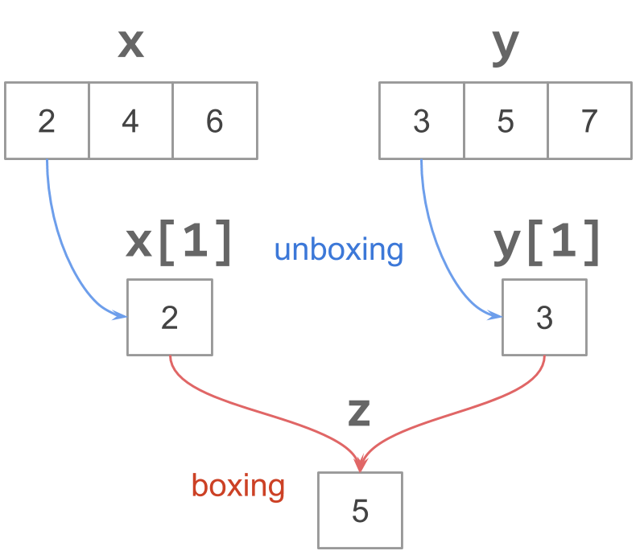

```{r, setup, include=FALSE}
library(knitr)
# smaller font size for chunks
knitr::opts_chunk$set(size = 'footnotesize')
options(width=78)
```

# 

\begin{center}
\Huge{\hilit{Programming Concepts}}
\end{center}


# References

Most of the content in these slides is a curated collection of notes and quotes from:

- __R Programming for Bioinformatics__ by Robert Gentleman.
- __Software for Data Analysis__ by John Chambers.
- __Extending R__ by John Chambers.
- __Advanced R__ by Hadley Wickham.
- __The Art of R Programming__ by Norman Matloff.
- __Introduction to Scientific Programming and Simulation Using R__ by 
O. Jones, R. Maillardet, and A. Robinson.


# R sessions

A typical session using R involves:

- starting R
- loading packages necessary to perform intended analysis
- loading data sets
- data manipulation in a variety of ways
- perhaps saving results and output to an external location
- _etc_


# R sessions

- For every R session you have a __workspace__.
- The workspace is referred to as the __global environment__.
- This is the place where the objects that you create will be stored.
- The function `ls()` lists the objects in your current workspace.
- More information about your session is provided with `sessionInfo()`.


# R language basics

- Programming in R is carried out by manipulating and modifying data structures.
- These different transformations are carried out using functions and operators.
- In R, virtually every operation is a function call.
- In many ways, R can be considered a functional programming language.
- Among other things, functions can be paassed as arguments to functions, 
and returned as values.


# Pretty much everything is a function call

Consider the following code
```{r eval = FALSE}
a <- 1:5
b <- 2
a + b
```

- The assignment operator `"<-"` is a function
- The colon operator `":"` is also a function
- The `"+"` operator is another function


# Pretty much everything is a function call

```{r eval = FALSE}
# colon operator as a function
":"(from = 1, to = 5)

# assignment as a function
"<-"(a, value = ":"(from = 1, to = 5))

# addition as a function
"+"(2, 3)
```


# Objects and Names

- As in any programming language, it's essential to be able to refer to objects, 
in a particular context, in a way that is consistent and clear.
- In R, there is one and only one way to refer to objects: by __name and an
environment__ (i.e. context)


# Objects and Names

```{r}
x <- 1
```

- Say you create a variable (i.e. object) `x`
- You use the assignment operator `<-` (or `=`) for this purpose
- Formally, this object has the name `"x"`
- The value of 1 is __assigned__ to the object `x`
- `x` lives in the __global environment__ (i.e. your workspace)
- `x` will be given a memory address


# Objects and references

To see the address of `x`, use `tracemem()`
```{r}
# memory address
tracemem(x)
```


# Objects and references

Unless you make an assignment to `x`, it will keep the same address:
```{r}
x + 2
log(x)
tracemem(x)  # same memory address as before
```


# Objects and references

When you make an assignment to `x`, it will change address:
```{r}
# assigning a name to x (will modify its memory address)
names(x) <- "a"
```


# Objects and Environments

- Any computation in R takes place in an environment.
- An environment defines how the evaluator will search for an object by name.
- The part of a program in which an object is defined is called its __scope__.
- We talked about environments when discussing function evaluation.


# 

\begin{center}
\Huge{\hilit{Assignments and Replacements}}
\end{center}


# Assignments

As you know, you can use the arrow operator `"<-"` to create objects, and 
also to modify them:
```{r}
x <- c(1, 2, 3)
x
x[1] <- 0
x
```


# Assignments

```{r}
# an assignment
x <- c(1, 2, 3) 

# is actually a call to the assignment function "<-"()
"<-"(x, value = c(1, 2, 3))
```


# Replacement

```{r}
# a replacement
x[1] <- 0

# is actually a call to the replacement function "[<-"()
x <- "[<-"(x, 1, value = 0)
```


# What happens in a replacement?

```{r}
# replacement
x[1] <- 0
```

- `x[1] <- 0` gives the impression of having changed the value of `x`.
- For practical purposes, you can say that "we changed the value of `x`".
- However, R didn't change `x` directly.
- Instead, a copy of `x` was created first, and then the modification took 
place in such copy.
- After that, the name `"x"` was assigned to the modified copy.


# What happens in a replacement?

In R, you constantly use expressions like this:
```{r}
z <- runif(4)
z
z <- z - mean(z)
z
```


# What happens in a replacement?

Consider the replacement expression: `z <- z - mean(z)`

- a replacement creates a new assignment of an object to the current name
- a new complete object `z` replaces the existing `z`
- this means that R makes a copy of `z`


# Replacements and Environments

- An object assigned in an environment would only be changed by another 
assignment:

```{r}
y <- 1:3
tracemem(y)
y[3] <- 5
```


# Copy-on-change policy

```{r}
# x and a copy of x, share the same address
x <- c(1, 2, 3)
y <- x
tracemem(x)
tracemem(y)
```


# What if you modify `x`?

```{r}
x[3] <- 4
tracemem(x)
tracemem(y)
```

`x` had an initial address, then was copied to another address, and ultimately
it ended in `r tracemem(x)`


# Copy-on-change policy

```{r eval = FALSE}
# what if you modify x?
x[3] <- 4
```

Even though we are changing just one element of the vector `x`, the entire
vector is reassigned. This means that the entire vector is copied, which can
take up a lot of time for long vectors (especially inside a loop).


# Boxing and Unboxing

```{r}
# how does R handle this addition?
x <- c(2, 4, 6)

y <- c(3, 5, 7)

z <- x[1] + y[1]
```


# Boxing and Unboxing




# Boxing and Unboxing

- Every value in R must be stored in a vector.
- This is true for values which look like scalars such as `TRUE`, `17`, and 
`"hello"`.
- Operations which are specified element-by-element on vectors occur overhead
because the elements must be extracted into a vector of length 1, processed,
and then transferred back to a longer vector.


# 

\begin{center}
\Huge{\hilit{Memory Management}}
\end{center}


# Memory allocation

- Memory management in R is automatic
- Users do not explicitly manage memory for R objects: you do not need to 
allocate or delete storage explicitly
- All objects are dynamically allocated at some time during the R session
- Evaluating function calls and assigning objects triggers allocation and occasional deallocation (via garbage collection)


# Memory and garbage collection

- In particular, objects cannot be deleted
- You can use the function `rm()` to remove the assignment of an object in an 
environment, but does not delete the memory of the object
- Unused dynamic storage is recovered by _garbage collection_
- Garbage collection takes place automatically and unpredictably


# Memory and garbage collection

- Garbage collector runs automatically whenever storage requests exceed the current free memory available
- It is possible to force garbage collection with the function `gc()`
- You can use `gcinfo()` to print information when the garbage collector runs
- Garbage collection recovers storage from objects that do not have a current
reference


# R's Memory Management

- In R, memory is divided into 2 separate components: 
    + memory for atomic vectors
    + memory for other language elements
    
\pause

- Vector storage is contiguous storage for homogenous elements (i.e. atomic)
- Vector storage is further divided into two types:
    + small vectors (less than 128 bytes) which are allocated in R
    + large vectors for which memory is obtained from the OS


# 

\begin{center}
\Huge{\hilit{Efficient Code}}
\end{center}


# R language basics

To use R effectively, it is important to understand which operations are
likely to be "expensive" and how the expense can be avoided.

## The main expensive operations are:

- Boxing and unboxing
- Data copying
- Argument matching (when calling a function)


# Data Copying

- When a value is passed into a function, R works hard to make it appear that 
it is a copy of the value which has been handed to the function.
- Many of the copy operations which R performs are unnecessary because code 
which decides whether it is necessary to copy errs on the conservative side.


# Argument Matching

- The presence of optional arguments to R functions means that function calls 
are relatively expensive. (Three passes are made over the argument list).
- Some functions (mainly the simple mathematical functions) avoid the overhead 
of argument processing.
- These functions are called _primitive_ and can be recognised by their 
appearance.


# R language basics

- The R evaluator is written in C.
- Many commands are written in C and thus do run in machine code.
- But most other functions (and the ones you write) are written in R itself.
- Those commands that use R code are thus interpreted.
    + R is an interpreted language.


# Functions written in C

Functions written in C are indicated with `.Primitive()`
```{r}
# addition operator
get("+")

# square root
sqrt
```


# Writing "optimized" R code

- Whenever possible use __Vectorization__
- Understand R's functional programming nature
- Understand how R uses memory
- Use some of R's optimized utility functions


# Looking at `for` loops

```{r}
x <- 1:10
y <- 21:30

# for-loop
z <- NULL
for (i in 1:length(x)) {
  # at each iteration we "expand" z with c()
  # (z gets copied and increases its memory)
  z <- c(z, x[i] + y[i])
}
```


# Looking at `for` loops

Adding two vectors element by element
```{r}
x <- 1:10
y <- 21:30

# for-loop
z <- NULL
for (i in 1:length(x)) {
  # at each iteration we "append" a new element to z
  # (z gets copied and increases its memory)
  z[i] <- x[i] + y[i]
}
```


# Looking at `for` loops

```{r}
x <- 1:10
y <- 21:30

# for-loop
z <- numeric(0)
for (i in 1:length(x)) {
  # at each iteration we "append" a new element to z
  # (z gets copied and increases its memory)
  z[i] <- x[i] + y[i]
}
```


# Looking at `for` loops

```{r}
x <- 1:10
y <- 21:30

# better to "allocate" 'z' with appropriate length 
z <- numeric(10)
for (i in 1:length(x)) {
  # at each iteration we "append" a new element to z
  # (z gets copied without increasing its memory)
  z[i] <- x[i] + y[i]
}
```


# R `for` loops

```{r}
z <- numeric(0)
for (i in 1:length(x)) {
  z[i] <- x[i] + y[i]
}
```

- `for()` is a function
- the colon operator `":"` is also a function
- vector subscript operation `"["` is also a function
- vector subscript assignment `"[<-"` is also a function
- each iteration allocates a new object `z`


# R `for` loops

```{r}
x <- 1:10
y <- 21:30

# there are many function calls inside this loop
z <- numeric(10)
for (i in 1:length(x)) {
  z[i] <- x[i] + y[i]
}
```


# About for loops

- R `for` loops have a bad reputation of being "slow"
- It is not `for` loops that are inherently slow
- It is what you do inside a loop that may be slow
- Especially when you perform many replacement operations


```{r}
x <- 1:10
y <- 21:30

# whenever possible use vectorized code
z <- x + y
```


# Vectorizaed functions

Many functions in R, and most functions that work with vectors, are already
vectorized:

- arithmetic
- trigonometric
- set operations
- comparison operators
- logical operators


# Vectorized Functions

Other vectorized functions are:

- `ifelse()`
- `which()`
- `where()`
- `any()`
- `all()`


# Vectorized matrix operations

- `rowSums()`
- `colSums()`
- `rowMeans()`
- `colMeans()`


# PS1 Example

A room contains 100 toggle switches, originally all turned off:
```{r}
num_switches <- 100
switches <- rep("off", num_switches)
```

- 100 people enter the room in turn.
- the first person toggles every switch
- the second  toggles every second switch
- the third every third switch, and so on, 
- to the last person who toggles the last switch only. 
- Which switches are turned on?


# PS1 Example: most common answer

```{r}
num_switches <- 100
switches <- rep("off", num_switches)

for (i in 1:num_switches) {
  positions <- seq(i, num_switches, by = i)
  for (pos in positions) {
    if (switches[pos] == "off") {
      switches[pos] <- "on"
    } else {
      switches[pos] <- "off"
    }
  }
}
```


# PS1 Example: with vectorized `ifelse()`

```{r}
switches <- rep("off", num_switches)

for (i in 1:num_switches) {
  positions <- seq(i, num_switches, by = i)
  switches[positions] <- ifelse(
    switches[positions] == "off", "on", "off")
}
```


# PS1 Example: my solution with a "lookup" vector

```{r}
switches <- rep("off", num_switches)

# ProTip: handy "lookup" vector
toggle <- c("on" = "off", "off" = "on")

for (i in 1:num_switches) {
  positions <- seq(i, num_switches, by = i)
  switches[positions] <- toggle[switches[positions]]
}
```


# Tools to time R code

There are various handy functions that can help you evaluate and profile 
your code:

- `proc.time()`: determines how much real and CPU time (in seconds) the 
currently running R process has already taken.
- `system.time()`: measures CPU time used in an __R expression__
- `Rprof()`: profiling of the execution of R expressions
- `microbenchmark()`: from package `"microbenchmark"`


# Function `proc.time()`

- `proc.time()` works as a stop-watch
- you initialize it to a starting time and then run all the desired code
- you stop it by subtracting the starting time from the ending time


# CPU time `proc.time()`

```{r eval = FALSE}
g <- rnorm(100000)
h <- rep(NA, 100000)

# Start the clock
proc_time <- proc.time()

# Loop through the vector, adding one
for (i in 1:100000){
	h[i] <- g[i] + 1
}

# Stop the clock
proc.time() - proc_time
```


# CPU time `proc.time()`

```{r }
g <- rnorm(100000)
h <- rep(NA, 100000)

# Start the clock
proc_time <- proc.time()
# vectorized addition
h <- g + 1
# Stop the clock
proc.time() - proc_time
```


# How to read `proc.time()` output?

- The values `user, system, elapsed` will be defined by your operating system.
- The `user` time relates to the execution of the code.
- The `system` time relates to your CPU, and it is the time spent in system calls.
- The `elapsed` time is the difference in times since you started the stopwatch. 
This is the actual time it took for the expression to be evaluated.
- It is usually the elapsed time which is important.


# Function `system.time()`

- `system.time()` is similar to `proc.time()`
- However, `system.time()` takes a single R expression as its argument
- Typically you encapsulate your code in a function and pass it to `system.time()`


# Timing code with `system.time()`

```{r}
fast_add <- function(x) { 
	return(x + 1)
}

system.time(fast_add(g))
```


# Timing code with `system.time()`

```{r}
loop_add <- function(x) { 
	y <- rep(NA, length(x))
	for (i in 1:length(x)){
		y[i] <- x[i] + 1
	}
	return(h)
}

system.time(loop_add(g))
```


# Monitoring with `Rprof()`

```{r}
num_switches <- 10000
switches <- rep("off", num_switches)

Rprof()
for (i in 1:num_switches) {
  positions <- seq(i, num_switches, by = i)
  for (pos in positions) {
    if (switches[pos] == "off") {
      switches[pos] <- "on"
    } else {
      switches[pos] <- "off"
    }
  }
}
Rprof(NULL)
summary_rprof <- summaryRprof()
```


# How `Rprof()` works?

- R inspects the call stack to determine which function calls are in
effect at that time
- It writes the result of each inspection to a file: `Rprof.out`
- The function `summaryRprof()` conveniently summarizes all those
lines in the file
- If the code you're profiling produces many function calls, the
profiling output may be hard to decipher.


# Some examples from Matloff (2011)

Expected value of the maximum of independent $N(0,1)$ random variables $X$ 
and $Y$:

```{r}
sum <- 0
num_reps <- 10000
for (i in 1:num_reps) {
  xy <- rnorm(2)  # generate 2 N(0,1)s
  sum <- sum + max(xy)
}
sum / num_reps
```


# Some examples from Matloff (2011)

Expected value of the maximum of independent $N(0,1)$ random variables $X$ 
and $Y$:

- generated 10,000 pairs with: `xy <- rnorm(2)`
- use a `for` loop to find the maximum for each pair: `max(xy)`
- compute estimated expected value: `sum / num_reps`


# Some examples from Matloff (2011)

```{r}
sum <- 0

num_reps <- 10000

for (i in 1:num_reps) {
  xy <- rnorm(2)  # generate 2 N(0,1)s
  sum <- sum + max(xy)
}
```

- at each iteration we call `rnorm()` and `max()`
- at each iteration there is an assignment operation


# A faster implementation

```{r}
num_reps <- 10000

xy_matrix <- matrix(rnorm(2 * num_reps), ncol = 2)

maximums <- pmax(xy_matrix[,1], xy_matrix[,2])

mean(maximums)
```


# Some Programming Habits

- Good programming is clear rather than clever
- Being clever is good, but given the choice, being clear is preferable
- You can start addressing a problem with a `for` loop that is _clear_
- Once you know the code works, then see what operations can be vectorized
- Identifying vectorized options takes time and practice


# Lessons

- Optimizing R performance can be a very dark art.
- Knowing about the detail of how functions work internally can be helpful
but is not essential.
- Experimentation with the code and timing the results with `system.time()`
can reduce times by orders of magnitude.
- In general, vectorization is abig win.
- Converting loops into vetorized alternatives almost always pays off.
- Code profiling can give you a way to locate those parts of a program which
will benefit most from optimiztion.


